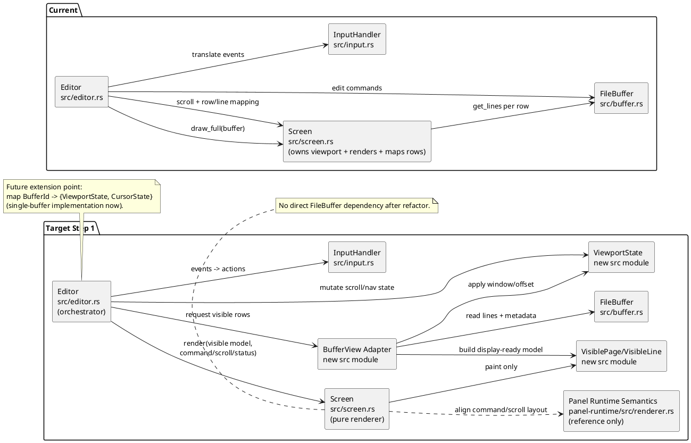
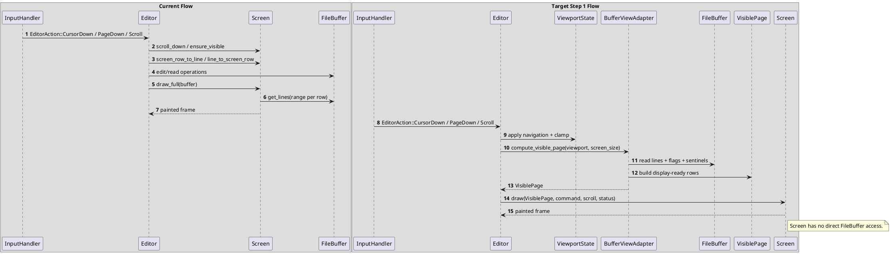

```plantuml
@startuml
skinparam componentStyle rectangle
left to right direction

package "Current" {
component "Editor\nsrc/editor.rs" as CurEditor
component "Screen\nsrc/screen.rs\n(owns viewport + renders + maps rows)" as CurScreen
component "FileBuffer\nsrc/buffer.rs" as CurBuffer
component "InputHandler\nsrc/input.rs" as CurInput

CurEditor --> CurScreen : draw_full(buffer)
CurEditor --> CurBuffer : edit commands
CurEditor --> CurInput : translate events
CurEditor --> CurScreen : scroll + row/line mapping
CurScreen --> CurBuffer : get_lines per row
}

package "Target Step 1" {
component "Editor\nsrc/editor.rs\n(orchestrator)" as NewEditor
component "ViewportState\nnew src module" as NewViewport
component "BufferView Adapter\nnew src module" as NewView
component "FileBuffer\nsrc/buffer.rs" as NewBuffer
component "Screen\nsrc/screen.rs\n(pure renderer)" as NewScreen
component "VisiblePage/VisibleLine\nnew src module" as NewVisible
component "InputHandler\nsrc/input.rs" as NewInput
component "Panel Runtime Semantics\npanel-runtime/src/renderer.rs\n(reference only)" as PanelRef

NewEditor --> NewInput : events -> actions
NewEditor --> NewViewport : mutate scroll/nav state
NewEditor --> NewView : request visible rows
NewView --> NewBuffer : read lines + metadata
NewView --> NewViewport : apply window/offset
NewView --> NewVisible : build display-ready model
NewEditor --> NewScreen : render(visible model,\ncommand/scroll/status)
NewScreen --> NewVisible : paint only
NewScreen ..> PanelRef : align command/scroll layout
}

note bottom of NewScreen
No direct FileBuffer dependency after refactor.
end note

note bottom of NewEditor
Future extension point:
map BufferId -> {ViewportState, CursorState}
(single-buffer implementation now).
end note

@enduml
```

PlantUML (before vs after)

```plantuml
@startuml
autonumber

box "Current Flow"
participant "InputHandler" as I1
participant "Editor" as E1
participant "Screen" as S1
participant "FileBuffer" as B1

I1 -> E1: EditorAction::CursorDown / PageDown / Scroll
E1 -> S1: scroll_down / ensure_visible
E1 -> S1: screen_row_to_line / line_to_screen_row
E1 -> B1: edit/read operations
E1 -> S1: draw_full(buffer)
S1 -> B1: get_lines(range per row)
S1 --> E1: painted frame
end box

box "Target Step 1 Flow"
participant "InputHandler" as I2
participant "Editor" as E2
participant "ViewportState" as V2
participant "BufferViewAdapter" as A2
participant "FileBuffer" as B2
participant "VisiblePage" as P2
participant "Screen" as S2

I2 -> E2: EditorAction::CursorDown / PageDown / Scroll
E2 -> V2: apply navigation + clamp
E2 -> A2: compute_visible_page(viewport, screen_size)
A2 -> B2: read lines + flags + sentinels
A2 -> P2: build display-ready rows
A2 --> E2: VisiblePage
E2 -> S2: draw(VisiblePage, command, scroll, status)
S2 --> E2: painted frame
note right of S2
Screen has no direct FileBuffer access.
end note
end box

@enduml
```